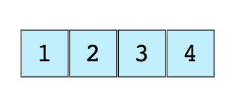
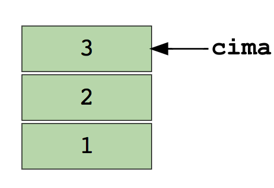
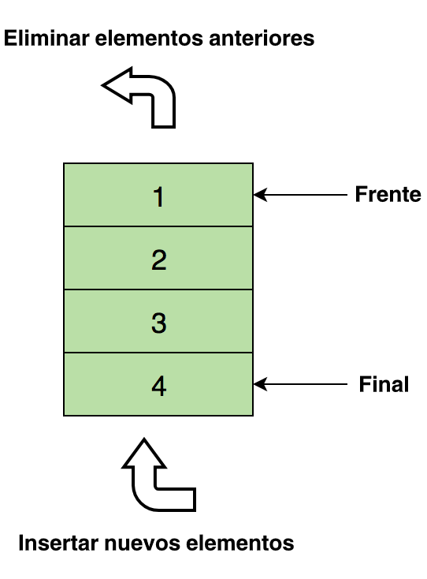
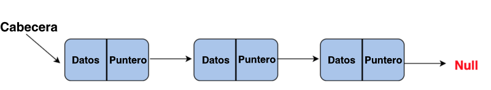
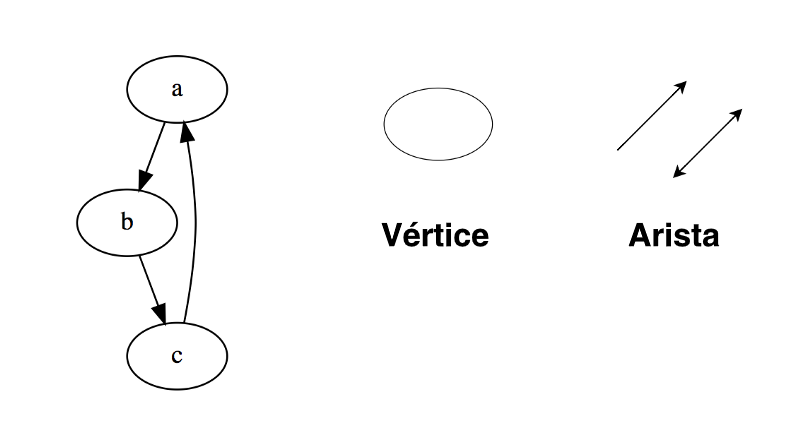
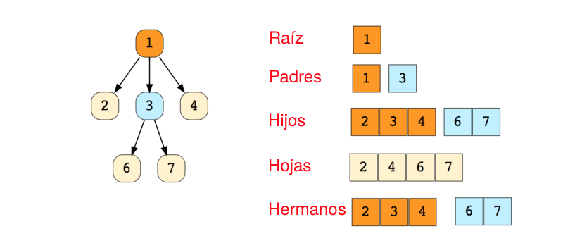
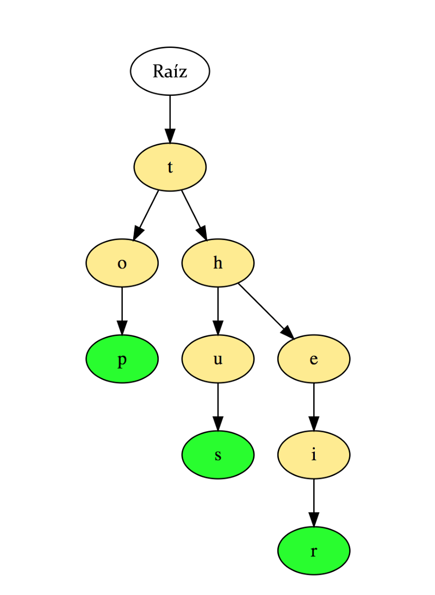
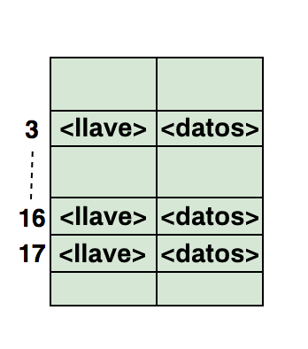

En computación, normalmente utilizamos los datos de forma conjunta. La forma como estos datos serán agregados y organizados depende mucho de como serán utilizados y procesados, considerando, por ejemplo, la eficiencia para buscar, el volumen de datos trabajados, la complejidad de implementación y la forma como los datos se relacionan. Estas formas de organización son las llamadas _estructuras de datos_.

Cada estructura de datos tiene un conjunto de métodos propios para realizar operaciónes como:

- Agregar o quitar elementos;
- Buscar y localizar elementos;
- Ordenar (clasificar) elementos de acuerdo con alguna orden especificada.

Las estructuras de datos pueden ser:

- Lineales (ej. arrays) o no lineales (ej. grafos);
- Homogéneas (todos los datos que componen la estructura son del mismo tipo) o heterogéneas (pueden contener datos de varios tipos);
- Estáticas (tiene tamaño/capacidad de memoria fija) o dinámicas (pueden expandir).

De manera simple, una estructura de datos es un contenedor que almacena datos en una disposición específica. Esta "disposición" permite que una estructura de datos sea eficiente en algunas operaciones e ineficiente en otras. Tu meta es comprender las estructuras de datos para que puedas elegir la que sea más óptima para el problema en cuestión.

### ¿Por qué necesitamos Estructuras de Datos?

Así como las estructuras de datos son usadas para almacenar datos de una forma organizada, y dado que los datos son la entidad más crucial en informática, el verdadero valor de las estructuras de datos es claro.

No importa qué problema estés resolviendo, de un modo u otro tienes que tratar con datos — ya sea el salario de un empleado, precios de acciones, una lista de compras, o incluso un directorio telefónico simple.

Basado en diferentes escenarios, los datos necesitan ser almacenados en un formato específico. Tenemos un puñado de estructuras de datos que cubren nuestra necesidad de almacenar datos en distintos formatos.

## Estructuras de Datos más Usadas

vamos a ver cuales son las mas usadas en la actualidad y veremos una por una a detalle

1. _Arreglos_
2. _Pilas_
3. _Colas_
4. _Listas Enlazadas_
5. _Árboles_
6. _Grafos_
7. _Tries_ (en realidad son árboles, pero es bueno mencionarlos por separado).
8. _Tablas Hash_

---

# Arreglos o Arrays

Un arreglo es la más simple y más usada estructura de datos. Otras estructuras de datos, como las pilas y las colas, provienen de los arreglos.

A continuación puedes ver una imagen de un arreglo simple de tamaño 4, que contiene elementos (1, 2, 3 y 4).

A cada elemento de datos se le asigna un valor numérico positivo llamado índice, que corresponde a la posición de ese elemento en el arreglo. La mayoría de los lenguajes definen al 0 (cero) como el índice inicial.

Los dos tipos de arreglos son:

- Arreglos unidimensionales (como el de la imagen de arriba)
- Arreglos multidimensionales (arreglos dentro de arreglos ej. una matriz)

## Operaciones Básicas con Arreglos

- **Insert** — Inserta un elemento en un índice dado
- **Get** — Devuelve el elemento sobre un índice dado
- **Delete** — Borra un elemento sobre un índice dado
- **Size** — Obtiene la cantidad total de elementos en un arreglo

## Preguntas Frecuentes sobre Arreglos en las Entrevistas

- Encontrar el segundo elemento mínimo de un arreglo
- Los primeros enteros no repetidos en un arreglo
- Combinar dos arreglos ordenados
- Reordenar los valores positivos y negativos en un arreglo

---

# Pilas

Todos conocemos la famosa opción Deshacer(Undo), que está presente en casi todas las aplicaciones. ¿Te has preguntado alguna vez cómo funciona? La idea: almacenas los estados previos de tu trabajo (que están limitados a un número específico) en la memoria en cierto orden tal que el último aparece primero. Esto no se puede hacer solo usando arreglos. Aquí es donde la Pila resulta útil.

Un ejemplo de la vida real del uso de la Pila podría ser una pila de libros colocados en orden vertical. Para obtener el libro que está en algún lugar en medio, necesitarás remover todos los libros que están encima de él. Así es como funciona el método LIFO (Last In First Out; en español UEPS, o Último en Entrar, Primero en Salir).

Abajo puedes encontrar una imagen de una pila que contiene 3 elementos de datos (1, 2 y 3), donde 3 está en la cima y será removido primero:

## Operaciones básicas de la pila:

- Push — Inserta un elemento en la cima
- Pop — Devuelve el elemento de la cima después de eliminarlo de la pila
- isEmpty — Devuelve verdadero si la pila está vacía
- Top — Devuelve el elemento que está en la cima sin eliminarlo de la pila

## Preguntas Frecuentes sobre Pilas en las Entrevistas

- Evaluar una expresión postfijas usando una pila
- Ordenar valores en una pila
- Comprobar paréntesis equilibrados en una expresión

---

# Colas

Similar a la Pila, la Cola es otra estructura de datos lineal que almacena elementos de manera secuencial. La única diferencia significativa entre la Pila y la Cola es que en lugar de usar el método LIFO, la Cola implementa el método FIFO (First In First Out; en español PEPS, o Primero en Entrar Primero en Salir).

Un ejemplo perfecto de la Cola en la vida real: una fila de personas esperando en taquilla. Si llega una nueva persona, se formará al final de la fila, no al inicio — y la persona situada al inicio de la fila será la primera en conseguir boleto y, por lo tanto, la primera en dejar la fila.

A continuación una imagen de la Cola conteniendo cuatro elementos de datos (1, 2, 3 y 4), donde 1 está al inicio y será removido primero:

## Operaciones básicas de la Cola

- Enqueue() — Inserta un elemento al final de la cola
- Dequeue() — Elimina un elemento del inicio de la cola
- isEmpty() — Devuelve verdadero si la cola está vacía
- Top() — Devuelve el primer elemento de la cola

## Preguntas Frecuentes sobre Colas en las Entrevistas

- Implementar una pila usando una cola
- Invertir los primeros k elementos de una cola
- Generar números binarios desde 1 hasta n usando una cola

---

# Lista enlazada

Una lista enlazada es otra estructura de datos lineal importante que a primera vista puede lucir similar a los arreglos, pero difiere en la asignación de memoria, la estructura interna y la forma en que se llevan a cabo las operaciones básicas de inserción y eliminación.

Una lista enlazada es como una cadena de nodos, donde cada nodo contiene información como datos y un puntero al siguiente nodo de la cadena. Hay un puntero a la cabecera, que apunta al primer elemento de la lista enlazada, y si la lista está vacía, entonces simplemente apunta a null o nada.

Las listas enlazadas son usadas para implementar sistemas de archivos, tablas hash y listas de adyacencia.

Aquí está una representación visual de la estructura interna de una lista enlazada:

A continuación se muestran los tipos de listas enlazadas:

- Lista Simple Enlazada (Unidireccional)
- Lista Doblemente Enlazada (Bidireccional)

## Operaciones básicas de las Listas Enlazadas

- **InsertAtEnd** — Inserta un elemento dado al final de la lista enlazada
- **InsertAtHead** — Inserta un elemento dado al inicio/cabeza de la lista enlazada
- **Delete** — Elimina un elemento dado de la lista enlazada
- **DeleteAtHead** — Elimina el primer elemento de la lista enlazada
- **Search** — Devuelve el elemento dado de una lista enlazada
- **isEmpty** — Retorna verdadero si la lista enlazada está vacía

## Preguntas Frecuentes sobre Listas Enlazadas en las Entrevistas

- Invertir una lista enlazada
- Detectar bucle en una lista enlazada
- Devolver el nodo N del final de una lista enlazada
- Eliminar duplicados de una lista enlazada

---

# Grafos

Un grafo es un conjunto de nodos que están conectados entre sí en forma de red. Los nodos son también llamados vértices. Un par(x,y) se denomina arista, que indica que el vértice x está conectado al vértice y. Una arista puede contener peso/costo, mostrando cuánto cuesta viajar del vértice x al y.

Tipos de Grafos:

- Grafo no dirigido
- Grafo dirigido

En lenguaje de programación, los grafos pueden ser representados de dos formas:

- Matriz de adyacencia
- Lista de adyacencia

  Algoritmos comunes de recorrido de grafos:

- Recorrido o Búsqueda en Amplitud o Anchura
- Recorrido o Búsqueda en Profundidad

## Preguntas Frecuentes sobre Grafos en las Entrevistas

- Implementar Recorrido en Amplitud o Anchura y en Profundidad
- Comprobar si un grafo es un árbol o no
- Contar el número de aristas en un grafo
- Encontrar el camino más corto entre dos vértices

---

# Árboles

Un árbol es una estructura de datos jerárquica que consiste en vértices (nodos) y aristas que los conectan. Los árboles son similares a los grafos, pero la diferencia clave entre ellos es que un ciclo no puede existir en un árbol.

Los árboles son usados extensamente en la Inteligencia Artificial y algoritmos complejos para proveer un mecanismo eficiente de almacenamiento para la resolución de problemas.

Abajo se puede ver la imagen de un árbol simple, y la terminología básica usada en la estructura de datos de un árbol:

Lo siguiente son los tipos de árboles:

- Árbol N-ario
- Árbol Equilibrado
- Árbol Binario
- Árbol de Búsqueda Binaria
- Árbol AVL
- Árbol Rojo Negro
- Árbol 2-3

De todos los mencionados, el Árbol Binario y el Arbol de Búsqueda Binaria son los más comúnmente usados.

## Preguntas Frecuentes sobre Árboles en las Entrevistas

- Hallar la altura de un árbol binario
- Hallar el k-ésimo valor máximo en un árbol de búsqueda binaria
- Hallar los nodos a "k" distancia desde la raíz
- Hallar los ancestros de un nodo dado en un árbol binario

---

# Trie

Trie, también conocido como "Árboles de Prefijos", es una estructura de datos en forma de árbol que prueba ser muy eficiente para resolver problemas relacionados con cadenas de caracteres. Proporciona una recuperación rápida y es mayormente usada para buscar palabras en un diccionario, proveer sugerencias automáticas en un motor de búsqueda, e incluso para enrutamiento IP.

Abajo hay una ilustración de cómo las tres palabras “top”, “thus”, y “their” se almacenan en un Trie:

Las palabras son almacenadas de arriba a abajo donde los nodos de color verde “p”, “s” y “r” indican el final de “top”, “thus”, y “their” respectivamente.

## Preguntas Frecuentes sobre Tries en las Entrevistas

- Contar el número total de palabras en un Trie
- Imprimir todas las palabras almacenadas en un Trie
- Ordenar los elementos de un arreglo usando un Trie
- Formar palabras a partir de un diccionario usando un Trie
- Construir un diccionario T9

---

# Tabla Hash

El Hashing es un proceso utilizado para identificar objetos de forma única, y almacenar cada objeto en algún índice único precalculado llamado su "llave". Entonces, el objeto es almacenado en forma de un par "llave-valor", y la colección de dichos elementos es llamada "diccionario". Cada objeto puede ser buscado usando esa llave. Hay diferentes estructuras de datos basadas en hashing, pero la más usada es la tabla hash.

Las tablas hash generalmente se implementan usando arreglos.

El rendimiento de la estructura de datos hash depende de estos tres factores:

- Función Hash
- Tamaño de la Tabla Hash
- Método de Manejo de Colisiones

Aquí hay una ilustración de cómo el hash es mapeado en un arreglo. El índice de este arreglo es calculado mediante una Función Hash.

## Preguntas Frecuentes sobre Hash en las Entrevistas

- Hallar pares simétricos en un arreglo
- Trazar el camino completo de un viaje
- Hallar si un arreglo es un subconjunto de otro arreglo
- Comproban si arreglos dados son disjuntos

Éstas son las principales estructuras de datos que definitivamente deberías conocer.
