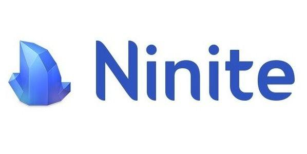
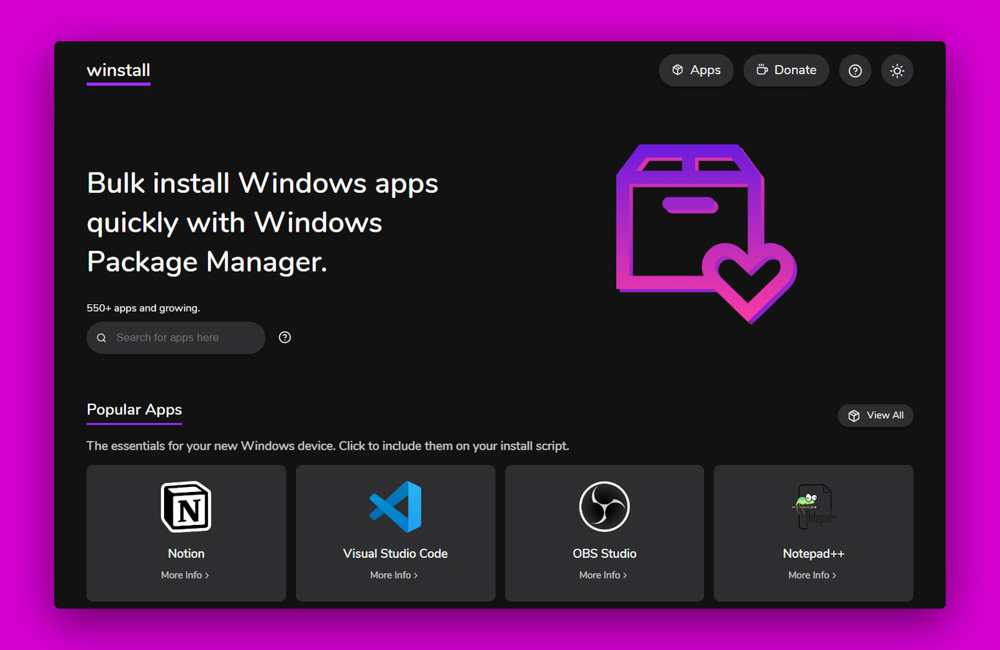

# instalar varias aplicaciones a la vez y sin adware

Cada vez que estamos haciendo mantenimiento a Pc's/Laptops o simplemente necesitamos instalar el sistema operativo nuevamente vamos a necesitar descargar e instalar diferentes aplicaciones. Casi siempre vamos al navegador y colocamos el nombre de la aplicación y buscamos la forma de descargar el aplicativo, esto tiene varios riegos, descargar software no oficiales (malicioso) o con adware.

Para evitar estos problemas y contratiempos hay herramientas que nos ayudan a gestionar mejor las descargas de las aplicaciones, haciendo mas rápido y efectivo el proceso.

En esta ocasión te traigo 2 herramientas

## Ninite

<a href="https://ninite.com/" target="_blank">Ninite</a> es una herramienta en línea que te permite instalar o actualizar múltiples aplicaciones en tu computadora con Windows de forma rápida y sencilla. Es como tener un asistente personal que se encarga de descargar e instalar todos los programas que necesitas, sin que tengas que preocuparte por configuraciones adicionales o software no deseado.

### ¿Cómo funciona Ninite?

1. Selecciona las aplicaciones: En la página web de Ninite, encontrarás una lista de las aplicaciones más populares. Solo tienes que marcar las que quieras instalar.

2. Crea un instalador personalizado: Ninite crea un único instalador que contiene todas las aplicaciones que seleccionaste.

3. Ejecuta el instalador: Descarga el instalador y ejecútalo. Ninite se encargará de instalar todas las aplicaciones de forma automática, sin interrupciones ni pantallas de bienvenida.

## Winstall

<a href="https://winstall.app/" target="_blank">Winstall</a> es una herramienta en línea que simplifica enormemente la instalación de aplicaciones en Windows 10. Funciona como una interfaz gráfica para el Windows Package Manager (Winget), una herramienta de línea de comandos integrada en Windows 10 que permite instalar y gestionar aplicaciones de una manera similar a como se hace en sistemas Linux.

## ¿Qué hace Winstall?

- Interfaz intuitiva: Winstall proporciona una interfaz web fácil de usar donde puedes buscar y seleccionar las aplicaciones que deseas instalar.
- Instalación rápida y masiva: Una vez que seleccionas las aplicaciones, Winstall genera automáticamente los comandos necesarios para instalarlas a través de Winget. Esto significa que puedes instalar múltiples aplicaciones con un solo clic.
- Amplia biblioteca de aplicaciones: Winstall te ofrece acceso a una gran variedad de aplicaciones, desde las más populares hasta herramientas más específicas.
- Actualizaciones: Te permite mantener tus aplicaciones actualizadas con facilidad

 

---

# ¿Por qué usar Ninite o Winstall?

- Ahorra tiempo: Olvídate de buscar y descargar cada aplicación por separado.
- Fácil de usar: La interfaz es muy intuitiva, incluso para usuarios sin experiencia en tecnología.
- Seguro: Ninite y Winstall no instala software adicional, como barras de herramientas o adware, lo que garantiza una instalación limpia.
- Actualizaciones automáticas: Puedes configurar estas herramientas para que mantenga tus aplicaciones siempre actualizadas a la última versión.
